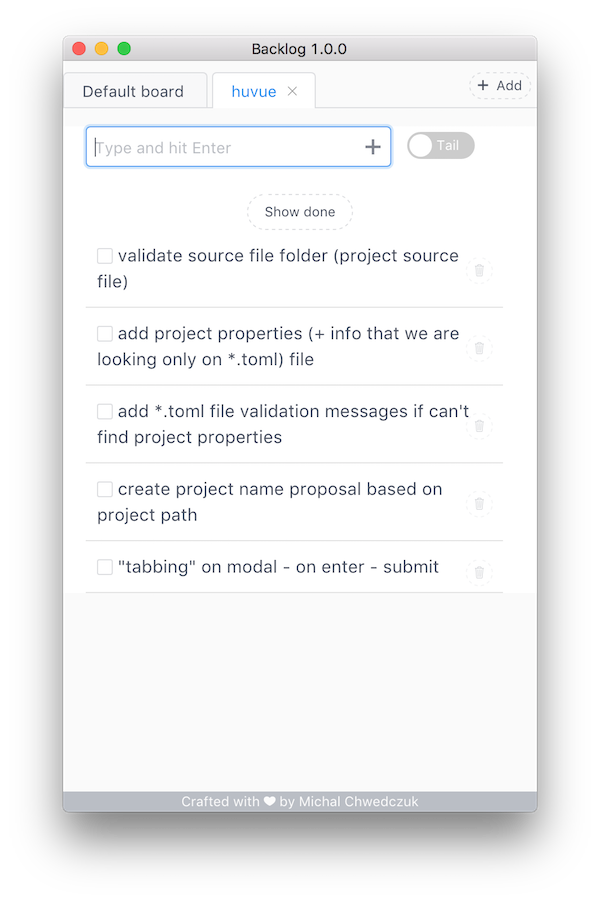

# Backlog

> Simple multiplatform desktop app for storing TODOs, ideas or backlog items. 
> You can organize them with boards. No dependencies, no internet connection required, 
> no external accounts. Sleek flow.

<p align="center">

</p>


# Download
No installation required. Just unzip archive and run executable
- [Windows version](http://czytelny.com/download/Backlog-win32-x64.zip)
- [MacOs version](http://czytelny.com/download/Backlog-darwin-x64.zip) 
- [Linux version](http://czytelny.com/download/Backlog-linux-x64.tar.gz)

See also [latest release notes](https://github.com/czytelny/backlog/releases/latest)

## Screenshot


## Update
When new version is available just download it, unzip and enjoy. No additional action is required. All your boards and items will be available.

## Why I write it ?
When programming I often have a number of ideas related to possible improvements for the future or a cool new project. Most often, it's just one sentence or a couple of words - just a draft of an idea to expand in the future. 

I know that, there are hundreds of *todo list managers* or other *notes manager*,
but this one will finally perfectly fulfill my needs. So far I wrote my thoughts on sticky notes, I tried Evernote, Simplenote... 
They are fine, but all of them were either bloated with unnecessary features or lacked the desired "flow" - 
when I open a program I want type down thoughts, hit enter, and get back to my actual work. That's how I write Backlog. No dependencies, no internet connection required, no external accounts etc.

## License
It's free and opensource application under **MIT** license. You can do whatever you want as long as you include the original copyright and license notice in any copy of the software/source

# Technical
#### How ?
This application is builded with [Electron](https://electron.atom.io) and web technologies (javascript, css, html) more specifically: [Vue.js](https://vuejs.org). UI toolkit is [iView](iviewui.com)

#### Build Setup
You can build it yourself instead of downloading executable:

``` bash
# install dependencies
npm install

# serve with hot reload at localhost:9080
npm run dev

# build electron application for production
npm run build


# lint all JS/Vue component files in `src/`
npm run lint

```

---

This project was generated with [electron-vue](https://github.com/SimulatedGREG/electron-vue)@[ef811ba](https://github.com/SimulatedGREG/electron-vue/tree/ef811ba974d696ee965da747315f20a034ebc590) using [vue-cli](https://github.com/vuejs/vue-cli). Documentation about the original structure can be found [here](https://simulatedgreg.gitbooks.io/electron-vue/content/index.html).
